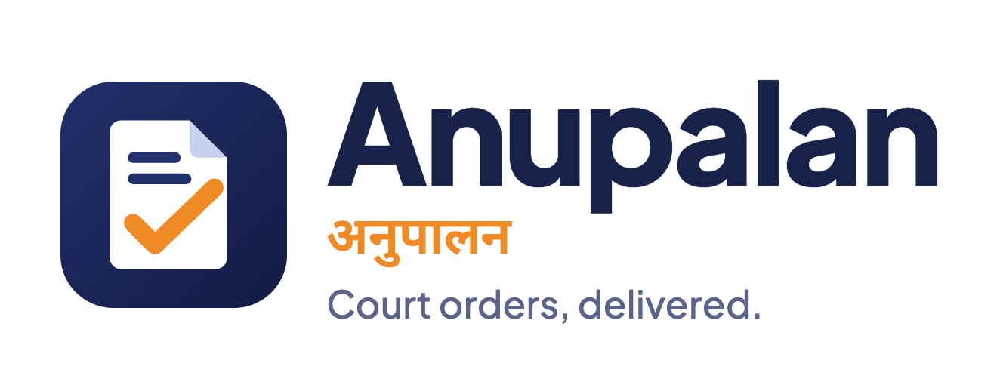
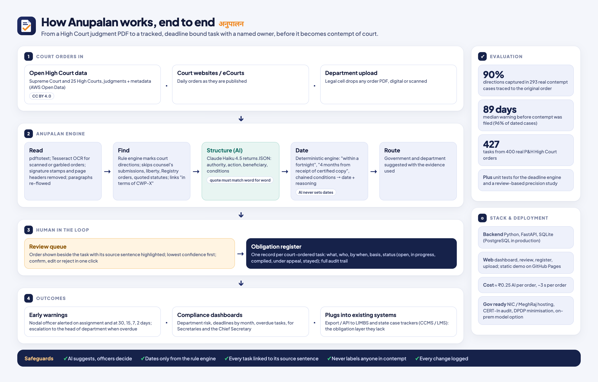

<p align="center"></p>

# Anupalan (अनुपालन): AI court-direction compliance register

**Anupalan turns High Court judgments into tracked, deadline-bound tasks for government departments, before they become contempt cases.**

## Links

| What it is | Link |
|---|---|
| Demo video (4 min pitch with a live walkthrough) | [youtu.be/uj6y0-Huw84](https://youtu.be/uj6y0-Huw84) |
| Live demo (read-only replay of 400 real Punjab & Haryana High Court orders) | [tushartechs.github.io/anupalan](https://tushartechs.github.io/anupalan/) |
| Source code | [github.com/TusharTechs/anupalan](https://github.com/TusharTechs/anupalan) |
| End-to-end architecture diagram | [docs/architecture-end-to-end.png](docs/architecture-end-to-end.png) |
| Engineering dossier (PDF, 7 pages) | [docs/Anupalan_Screen2_engineering_dossier.pdf](docs/Anupalan_Screen2_engineering_dossier.pdf) |
| BOM, unit cost and calculations (Excel) | [docs/Anupalan_BOM_and_calculations.xlsx](docs/Anupalan_BOM_and_calculations.xlsx) |
| Evaluation method and contempt backtest | [docs/EVALUATION.md](docs/EVALUATION.md) |
| Court data used (open dataset, CC BY 4.0) | [Indian High Court Judgments on AWS Open Data](https://registry.opendata.aws/indian-high-court-judgments/) |

[](https://youtu.be/uj6y0-Huw84)

When a court orders a department to act ("decide the representation within three months", "release the arrears within a fortnight"), the order sits inside a PDF. Government case trackers (LIMBS and state CCMS/LMS systems) record hearings and next dates, typed in by officers. Anupalan reads the order itself and does four things:

* it extracts **each direction**: what must be done, by which authority, under what conditions, with the exact source sentence;
* it computes **the deadline** with a deterministic engine that explains its basis ("4 months from receipt of certified copy; receipt assumed 7 days after the order");
* it routes the task to a **legal officer to confirm** (AI suggests, humans decide);
* it **tracks and warns**: alerts before the deadline, escalation when overdue, and department dashboards.

> Built for the SEVA FIRST Innovation Challenge 2026 (DTU, Northern Region), category REG-011-OP.

## Evidence it works (real data, not a mock-up)

| Test | Result |
|---|---|
| Real Punjab & Haryana High Court orders processed (open data, 2025) | **400 writ orders → 427 court-ordered obligations**, 243 with a computed deadline |
| **Backtest:** 293 real contempt petitions traced back to the original order that was allegedly disobeyed | Direction captured in **90%** of original orders; deadline computed in **66%** |
| Of those with a deadline, deadline passed **before** the contempt petition was filed | **96%**; median **89 days** of warning departments never got |
| Median time from the court's order to the citizen filing contempt | **177 days** |
| AI cost per order (Claude Haiku 4.5, measured) | ~1,300 input + ~250 output tokens per order |

Method and caveats: [`docs/EVALUATION.md`](docs/EVALUATION.md).

## Architecture: how it works end to end



1. **Court orders in**: open High Court data, court websites, or a department's upload.
2. **Anupalan engine**: read (text or OCR) → find directions (rule engine) → structure them (Claude, quote must match word for word) → compute the deadline (deterministic rules, never the AI) → route to a government and department.
3. **Human in the loop**: a legal officer confirms, edits or rejects each task beside its highlighted source sentence; confirmed tasks enter the obligation register with a full audit trail.
4. **Outcomes**: alerts before the deadline and escalation after it, compliance dashboards, and export to LIMBS and state case trackers.

| Module | Role |
|---|---|
| `anupalan/textprep.py` | `pdftotext`, OCR fallback (Tesseract) for scanned/garbled orders, signature-stamp and page-header removal, paragraph re-flow |
| `anupalan/directions.py` | Rule engine: directive sentences; excludes counsel's submissions, prayers, liberty clauses, Registry directions, quoted statutes; finds "disposed of in terms of CWP-X" references |
| `anupalan/llm.py` | Optional LLM layer (Anthropic API, or `claude` CLI for development). Hallucination guard: quotes must be found in the order |
| `anupalan/deadline.py` | "within a fortnight", "six weeks from receipt of certified copy", chained "file within 4 weeks… decide within 3 months of receipt", "expeditiously" → date + basis + assumptions |
| `anupalan/mapping.py` | Government and department suggestion with evidence |
| `anupalan/pipeline.py` | Order → obligations; alert schedule |
| `anupalan/store.py`, `app.py` | SQLite register with audit trail; FastAPI API; serves the web app |
| `anupalan/backtest.py`, `scripts/` | Contempt backtest, demo loader, static export |
| `web/` | Dashboard, review queue, register, backtest, upload (works live or as a read-only static demo) |

**Where AI is not allowed to decide:** dates (rules only), final acceptance of any task (legal officer), and any statement about whether someone is in contempt (never made). Every extraction stores its source span and is auditable.

## Run it

```bash
python3 -m venv .venv && ./.venv/bin/pip install -r requirements.txt
# optional: AI layer. Put the key in .env (never committed): LLM_API_KEY=sk-ant-...
ANUPALAN_AS_OF=2025-10-01 ./.venv/bin/uvicorn anupalan.app:app --port 8765
# open http://localhost:8765 and drop any High Court order PDF on "Add a court order"
```

Needs `pdftotext`/`pdftoppm` (Poppler) and `tesseract` for OCR. Without an API key the pipeline runs rules-only.

Reproduce the data and backtest (downloads public PDFs from the open dataset):

```bash
./.venv/bin/python scripts/fetch_sample.py        # P&H HC metadata + sampled orders (AWS Open Data, no account)
./.venv/bin/python scripts/load_demo.py           # 400 writ orders → register
./.venv/bin/python scripts/run_backtest.py        # contempt backtest
./.venv/bin/python scripts/backtest_summary.py
./.venv/bin/python -m pytest -q
```

## Data and licence

* Court orders: [Indian High Court Judgments](https://registry.opendata.aws/indian-high-court-judgments/) (Dattam Labs, from eCourts), **CC-BY-4.0**. Raw PDFs are not committed; `web/demo/` contains derived text and extractions for the public demo, with attribution.
* Code: MIT (see `LICENSE`).
* Anupalan is advisory. It does not give legal advice or predict court outcomes; a legal officer confirms every task.
